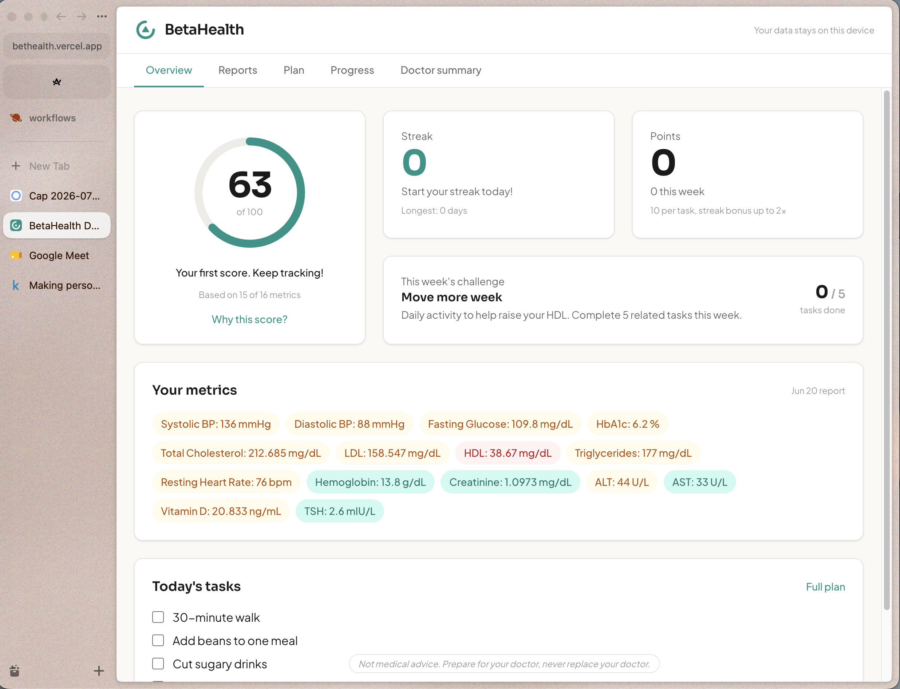
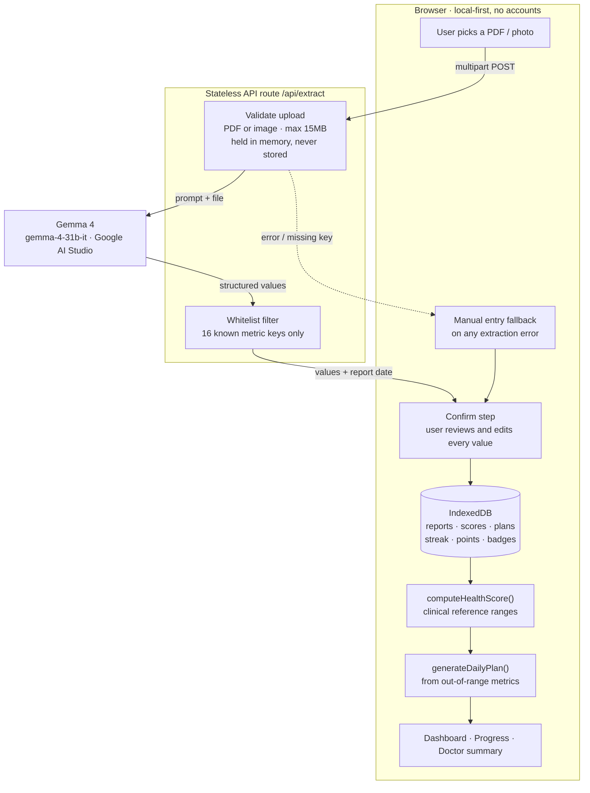
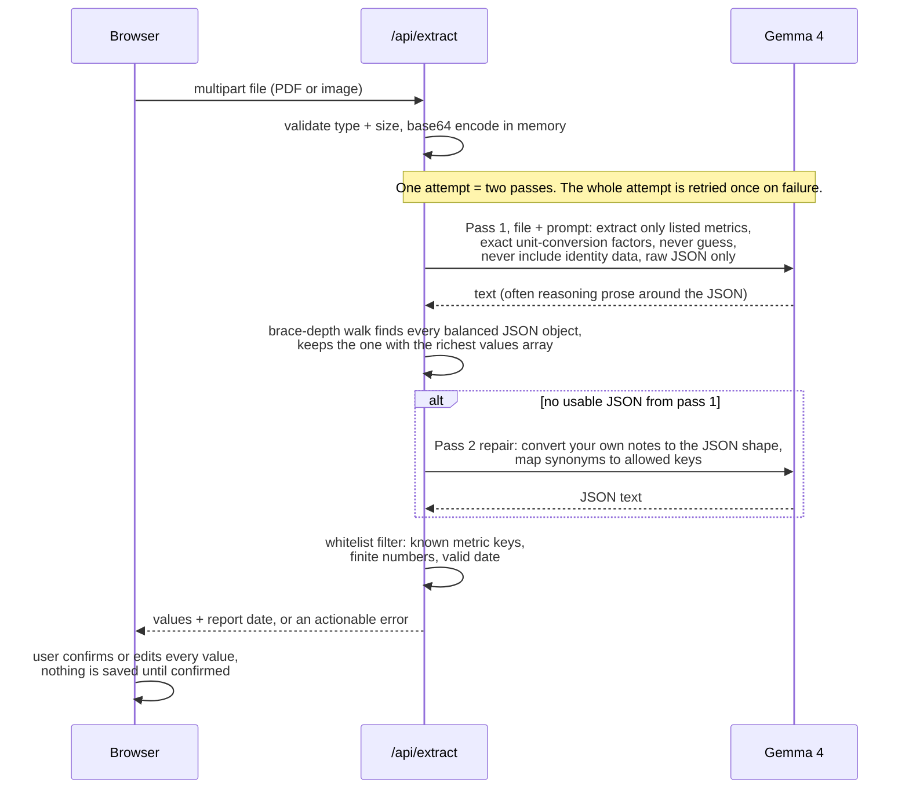

<div align="center">


# BetaHealth

**Turn a discarded lab report into a score, a plan, and a progress log you bring back to your doctor.**

[Live demo](https://bethealth.vercel.app) · [Demo video](https://youtu.be/RSGs1wKQjAs?si=dpq0r6ZkbgKyvPCA) · [Sample report to try](https://bethealth.vercel.app/sample-report.pdf)

[](https://youtu.be/RSGs1wKQjAs?si=dpq0r6ZkbgKyvPCA)

*Click the screenshot to watch the demo.*

</div>

People come home with lab reports, glance at them once, and throw them away. The data never becomes action, and by the next appointment nobody remembers what changed. BetaHealth reads the report with Gemma 4, turns it into a Health Score and a daily plan, and keeps everything on your device.

> [!NOTE]
> Not medical advice. BetaHealth prepares you for your doctor, it never replaces your doctor.

## Features

- **Drop in a lab report** (PDF or photo): Gemma 4 extracts the values, and you confirm every number in an editable table before anything is saved
- **Health Score** computed from clinical reference ranges (AHA, ADA, NCEP, WHO), with a per-metric breakdown and a "why this score" explanation
- **Daily plan**: tasks and foods, each tied to a specific out-of-range metric with its reason shown
- **Streaks, points, and badges**: always recomputed from saved history, so they cannot drift or be gamed
- **Progress over time**: re-test, add the new report, watch the score move
- **Doctor summary**: a one-page export with metric trends, score history, tasks completed, and your notes
- **Local-first**: all health data lives in IndexedDB on the device. No accounts, no tracking

## How it works



## Where Gemma 4 sits

Gemma 4 (`gemma-4-31b-it`, Google AI Studio API) does exactly one job: reading the uploaded report with its vision capability and returning structured values. Everything else is deterministic code.

- The report file goes to a stateless endpoint ([`src/pages/api/extract.ts`](src/pages/api/extract.ts)), is forwarded to Gemma, and is never stored or logged
- Gemma does not support constrained JSON output, so the endpoint enforces the shape by prompt and, when Gemma answers in prose, runs a second Gemma pass that converts its own notes into the required JSON
- Responses are filtered to 16 known metric keys, so names, patient IDs, and other identity data can never come back. The prompt also forbids extracting them
- The Health Score is never LLM-generated; scoring bands and weights live in one policy file, [`src/lib/scoring.ts`](src/lib/scoring.ts)
- Extraction failures show their specific reason and fall back to manual entry, which uses the same confirm table

<details>
<summary><b>Extraction pipeline in detail</b> (two passes, one retry)</summary>



</details>

## Privacy

- Local-first: all health data lives in IndexedDB on the device. No accounts, no tracking
- Only the tracked lab values and the report date come back from extraction
- Users can redact names and IDs before uploading; extraction only needs the numbers

## Run locally

```bash
npm install
echo "GEMINI_API_KEY=your_google_ai_studio_key" > .env
npm run dev
```

The app runs fully without the key; extraction reports itself unconfigured and manual entry takes over.

## Stack

Astro 5 · React islands · Tailwind · IndexedDB ([`idb`](https://www.npmjs.com/package/idb)) · Gemma 4 via the Google AI Studio API · deployed on Vercel
